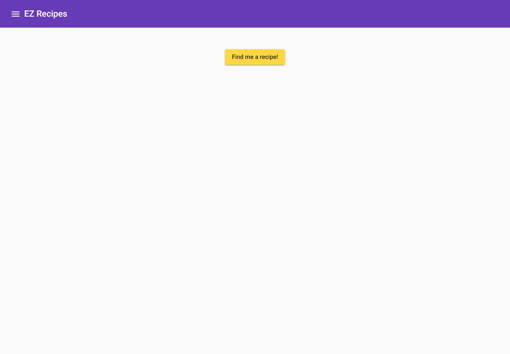
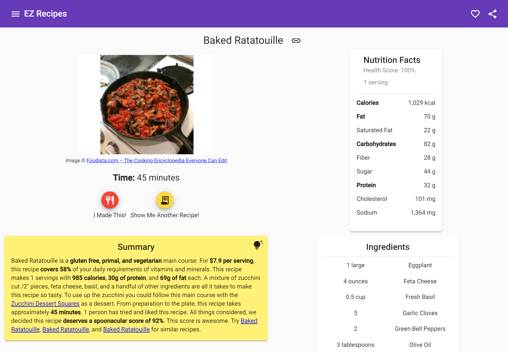
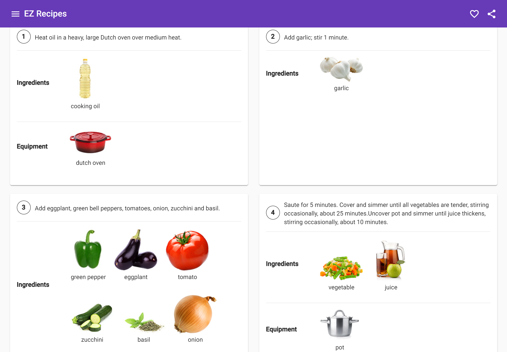

# EZ Recipes Web App

    
    
    

## Overview

Cooking food at home is an essential skill for anyone looking to save money and eat healthily. However, learning how to cook can be daunting, since there are so many recipes to choose from. And even when meal prepping, knowing what ingredients to buy, what equipment is required, and the order of steps to make the meal can be hard to remember for many different recipes. Plus, during busy days, it's nice to be able to cook up something quick and tasty.

Introducing EZ Recipes, an app that lets chefs find low-effort recipes that can be made in under an hour, use common kitchen ingredients, and can produce multiple servings. On one page, chefs can view what the recipe looks like, its nutritional qualities, the total cooking time, all the ingredients needed, and step-by-step instructions showing what ingredients and equipment are required per step. Each recipe can be shared so other chefs can learn how to make the same recipes.

## Features

- Single-Page Web Application created using Angular
- TypeScript for type safety and SCSS for enhanced CSS syntax
- Responsive and accessible web design
- Best practices for Progressive Web Apps
- Search Engine Optimization (SEO)
- REST APIs to a custom [server](https://github.com/Abhiek187/ez-recipes-server), which fetches recipe information from [spoonacular](https://spoonacular.com/food-api)
- Automated testing and deployment using CI/CD pipelines in GitHub Actions
- Containerized development and production environments using Docker

## Installing Locally

1. [Clone](https://github.com/Abhiek187/ez-recipes-web.git) this repo.
2. Run `npm install` to install all the dependencies.
3. Run `npm start` for a dev server. Navigate to `http://localhost:4200/`. The application will automatically reload if you change any of the source files.
4. In a separate terminal, follow the steps to set up the [EZ Recipes server](https://github.com/Abhiek187/ez-recipes-server#installing-locally), so the recipes can be fetched locally.
5. When done, press `Ctrl-C` to stop the server.

### Testing

Run `npm test` to run the unit tests using Karma.

### Build

Run `npm run build` to build the project. The build artifacts will be stored in the `dist/` directory. Then run `python3 -m http.server -d dist/ez-recipes/ PORT` to serve the page over a simple HTTP server. (By default, `PORT` is 8000.)

### Further Help

To get more help on the Angular CLI use `ng help` or go check out the [Angular CLI Overview and Command Reference](https://angular.io/cli) page.

## Docker

### Development

1. Build the Docker image: `docker build . -t TAG_NAME`
2. Run the image in a container: `docker run --rm -p 4200:4200 -d TAG_NAME`
3. Open `localhost:4200`

### Production

1. Build the Docker image: `docker build . -t TAG_NAME -f Dockerfile.prod`
2. Run the image in a container: `docker run --rm -p 4200:80 -d TAG_NAME`
3. Open `localhost:4200`

Run `docker kill <container id>` to shut down the image when done. The container ID can be found using `docker ps`.

## Future Updates

EZ Recipes is currently in an MVP state. Chefs can view random recipes and browse recipes by their ID. But more features will come in the future to enhance the cooking experience, including (but not limited to):

- An [iOS](https://github.com/Abhiek187/ez-recipes-ios) and [Android](https://github.com/Abhiek187/ez-recipes-android) app to go alongside the web app. A hybrid app was considered to speed up the development process, but native apps were preferred to improve the UX across all platforms and reduce the risk of compatibility issues as the app grows and more 3rd party libraries are incorporated.
- The ability to save recipes locally and remotely in a database
- Accounts so chefs can sync their favorite recipes across all their devices
- The ability to favorite, rate, and view the popularity of recipes
- An enhanced home page showing recently viewed recipes and any recommended/popular recipes
- Showing additional recipe information, such as potential allergies
- Filtering recipes by name or various metrics, such as whether they're healthy, vegetarian, or spicy
- Helpful tooltips showing the definition of certain cooking terms, to better assist newer chefs in learning how to cook or prep certain ingredients and how to use certain kitchen tools. Think [How to Stock](https://github.com/Abhiek187/how-to-stock), but for cooking food instead of managing finances.
